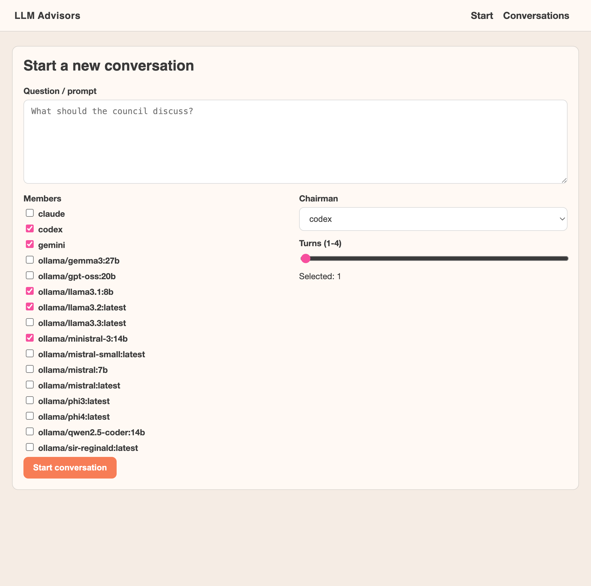
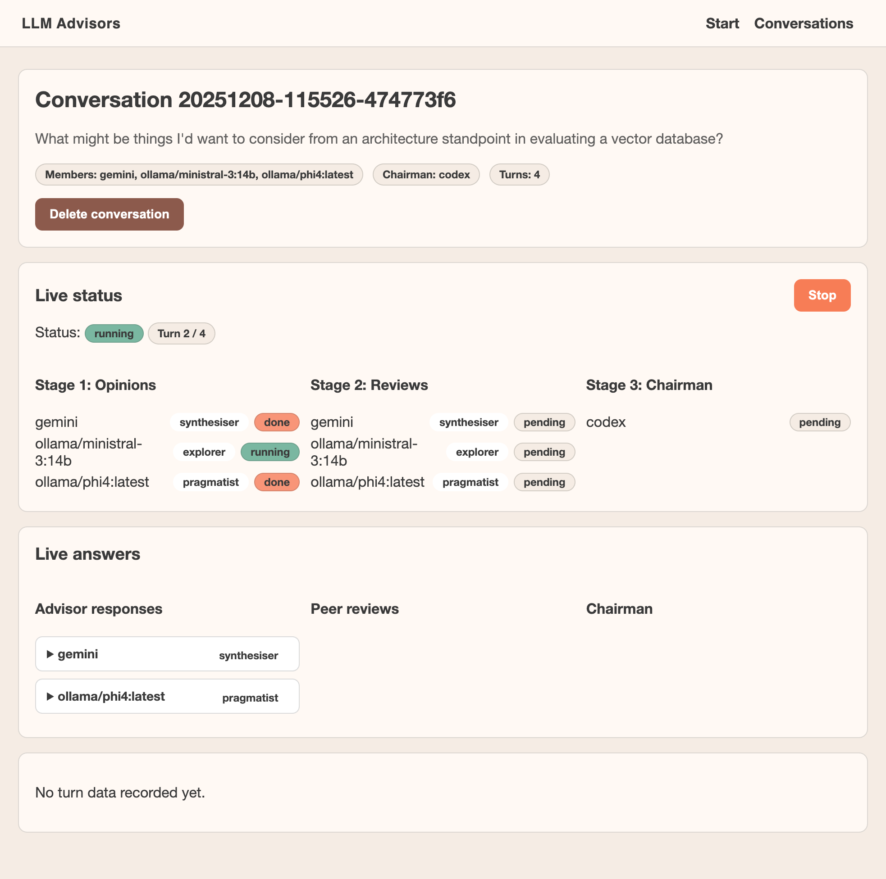
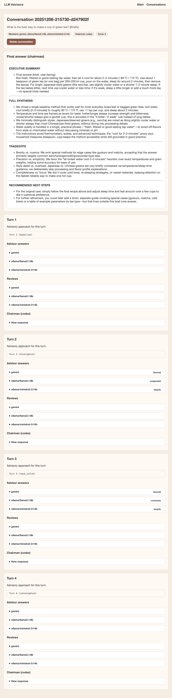

# llm-advisors

A small CLI and web app that lets you run a "board of LLMs as advisors" using:

- Codex (OpenAI CLI)
- Claude Code
- Gemini CLI
- Ollama (local models)

It **does not** use any extra API keys – it shells out to the official CLIs,
which authenticate using your existing subscriptions/accounts, and to Ollama
for local models.

Vibe coded in an afternoon with codex.

The behaviour is inspired by Karpathy’s
[llm-council](https://github.com/karpathy/llm-council), but instead of going
via OpenRouter/API keys, it coordinates multiple CLIs you already use.

## 1. What it does

Run a structured, multi-turn “council” of LLMs via the CLIs you already have.
It shells out to Codex/Claude/Gemini/Ollama and orchestrates up to 4 turns:

- **Turn 1 – baseline**: advisors answer freely; chairman synthesises and
  produces a summary object.
- **Turn 2 – divergence**: advisors get roles (Explorer/Skeptic/etc.) and push
  new ideas; chairman produces a task sheet.
- **Turn 3 – task solving**: advisors solve the task sheet; chairman builds a
  convergence-prep summary.
- **Turn 4 – convergence**: advisors propose finals; chairman produces the
  final answer.

Roles rotate after turn 1 to avoid stagnation. All prompts/results are logged
per conversation; the web UI shows live status and stores artefacts for later
review. Ollama models on your machine are discovered automatically for
selection in the web UI.

[](https://www.youtube.com/watch?v=7Xft86ihGfs)

https://youtu.be/7Xft86ihGfs

---

## 2. Requirements

You’ll need:

- **Python**: 3.11 or newer
- A working install of the following CLIs (pick the ones you care about):
  - `codex` (OpenAI / ChatGPT CLI)
  - `claude` (Claude Code CLI)
  - `gemini` (Gemini CLI)
  - `ollama` (local LLM runtime)

Each CLI must already be:

- Installed on your `$PATH`
- Logged in / configured to use whatever account or plan you have
- Working from the shell by itself (e.g. `codex "hello"`, `claude -p "hello"`,
  `gemini -p "hello"`, `ollama run llama3.2 "hello"`)

For Ollama, you’ll also need at least one model pulled, for example:

```bash
ollama pull llama3.2
```

## 3. Install (with venv)

Use a virtual environment so dependencies stay contained:

```bash
python3 -m venv .venv
source .venv/bin/activate
pip install -e .
```

You can also invoke it from the repo root without installing via
`./llm-advisors "<question>"`, but the editable install inside a venv keeps
your global Python clean.

## 4. Usage

Ask the advisors a question:

```bash
llm-advisors "When should I use vector search vs full text search?"
```

Useful flags:

- `--members`: override which providers answer/review (defaults to config).
  Accepts `codex claude gemini ollama` and Ollama model overrides like
  `ollama/llama3.1:8b`.
- `--chairman`: choose who synthesises the final answer (defaults to config).
- `--turns`: run multiple council rounds (opinions → reviews → chairman) and
  feed the last chairman answer into the next turn.
- `--show-intermediate`: print stage 1 answers and stage 2 reviews for each
  turn.
- `--show-turns`: print a short summary per turn after the final answer.
- `--max-parallel`: global max concurrent provider calls (default 4).
- `--ollama-parallel-mode`: `sequential` (default) | `limited` | `parallel`.
- `--ollama-max-parallel`: when mode=`limited`, how many Ollama calls to allow.
- `--log-dir`: where to write conversation artefacts (default
  `conversations/`).
- `--log-disabled`: skip writing artefacts.

Examples:

```bash
# Ask only Codex and Claude, use Claude to chair
llm-advisors --members codex claude \
    --chairman claude "How do I debounce an async function?"

# Ask two specific Ollama models and Codex, show intermediate output
llm-advisors --members ollama/llama3.1:8b ollama/qwen2.5 codex \
    --chairman codex --show-intermediate "How does a vector work?"
```

If a provider CLI fails, you’ll see a `ProviderError` with the CLI exit code
and stderr - fix the underlying CLI and rerun, or disable that provider (see
config below).

### Multi-turn and artefacts

- `--turns N` runs up to 4 structured turns:
  - 1 turn: baseline synthesis
  - 2 turns: baseline → final convergence
  - 3 turns: baseline → divergence → final convergence
  - 4 turns: baseline → divergence → task solving → final convergence
- Post-baseline turns assign rotating roles (Explorer/Skeptic/etc.) to push
  divergence.
- Structured artefacts (summaries, task sheets, convergence prep) feed each
  turn.
- Every run gets a conversation ID. Artefacts live under `conversations/<id>/`
  as `meta.json` plus `turn-01.json`, `turn-02.json`, etc. Disable with
  `--log-disabled`.

### Web UI

A minimal local UI is available:

```bash
llm-advisors-web

# or

python -m llm_advisors_cli.web
```

It serves on `http://127.0.0.1:8000/` and lets you start conversations, pick
members/chairman/turns, watch live per-member status (with a stop control), and
browse/delete past runs from `conversations/`. Ollama models installed locally
are auto-discovered and shown as `ollama/<model>` options.

### Screenshots

Home / start page (question, advisors, turn slider):



Live status during a run (roles + per-member progress):



Conversation detail with final answer plus turn artefacts:



## 5. Configuration

Configuration is optional. Defaults live in code (`codex`, `claude`, `gemini`,
`ollama` as members; `codex` as chairman). If present, config is read from:

`~/.config/llm_advisors/config.toml`

Structure:

```toml
[general]
# order matters for labelling A/B/C/… 
members = ["codex", "claude", "gemini", "ollama/llama3.2"] 

# who synthesises the final answer
chairman = "claude" max_parallel = 4

[providers.codex]
enabled = true                      # set false to skip entirely
command = "codex"                   # override the binary name/path
extra_args = ["--no-color"]         # appended before the prompt

[providers.claude]
enabled = true
extra_args = ["-p"]                 # defaults used if not provided

[providers.gemini]
enabled = false                     # example of disabling one provider

[providers.ollama]
model = "llama3.2"                  # default model when using bare `ollama`
extra_args = []                     # e.g. ["--timeout", "60"]

[parallelism.ollama]
mode = "sequential"                 # sequential | limited | parallel
max_parallel = 1                    # used when mode = limited

[logging]
enabled = true
base_dir = "conversations"
```

Runtime flags always win over config values. To use a specific Ollama model
once, pass `--members ollama/llama3.1:8b` (or set `chairman` to `ollama/…`).
You can also point `command` to a mock script if you want to stub providers
during development.
